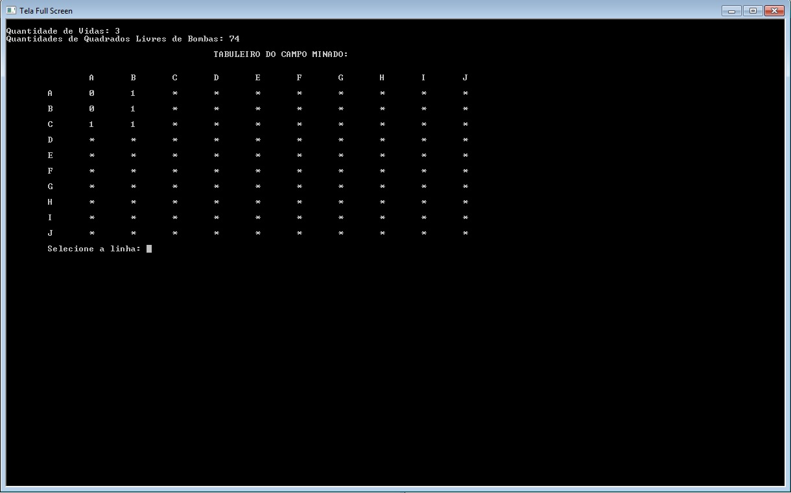

# Campo-Minado
Projeto do primeiro período.

## Controle:

### Menu
- digite '1' e logo em seguida de Enter para selecionar Novo Jogo
- digite '2' e logo em seguida de Enter para carregar o jogo salvo
- caso decidiu a opção 1 digite de '1' a '3' para selecionar a dificuldade.

### Jogo
- digite primeiro a linha de 'A' até 'H' e de Enter
- depois digite a coluna de 'A' até 'H' e de Enter
